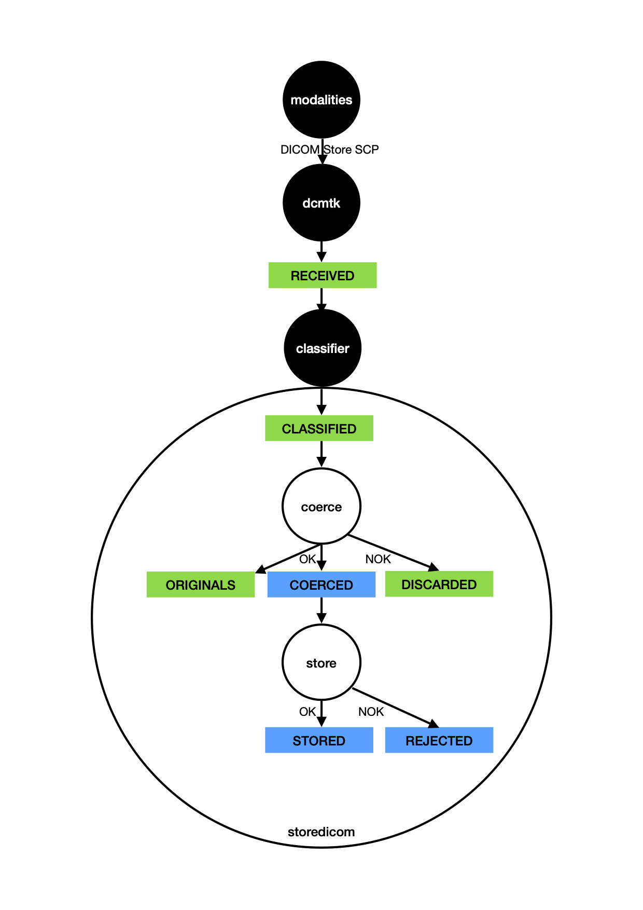

# storedicom

Permite la normalización de los objetos DICOM antes que entren en el repositorio definitivo, o sea el PACs.

Verifica y Modifica los objetos DICOM creados por las modalidades antes de ingresarlos en forma defitiva al PACS.

Recibe los objetos por servicio STORE SCP como si fuese un PACS, les hace pasar por un pipeline de verificación y modificación y finalmente intenta enviarlos al PACS como cliente STORE DICOMweb.

La aplicación se coloca dentro de la red imagenológica y se configura como SCP (aet, ip, puerto) de destino de las operaciones DICOM STORE SCU realizadas por las modalidades de adquisición de imágenes médicas (CR, DX, CT, MR, etc). Usamos el STORE SCP de la caja de herramientas de código libre **dcmtk**, muy confiable y universal.

El pipeline de procesamiento de los objetos dicom recibidos está materializado por una estructura de directorios, dentro de la cual los objetos están desplazados a medida que avanza su procesamiento.

El directorio raíz de esta estructura tiene por nombre el aet usado por dcmtk para este canal. Es posible crear más de un canal de recepción, cada uno con su propio directorio raíz. Es recomendable ubicar este directorio raíz dentro de un volumen de acceso rápido en lectura y escritura. Clasificados del mejor al mínimo listamos: ssd, raid5, NAS conectado con enlace 1000baseT.

Este directorio contiene 7 subdirectorios:

- ARRIVED
- CLASSIFIED
- DISCARDED
- ORIGINALS
- COERCED
- REJECTED
- STORED

## ARRIVED y CLASSIFIED

ARRIVED y CLASSIFIED están usados por dcmtk. dcmtk:

- recibe un objeto, 
- crea si necesario un subdirectorio de ARRIVED con el nombre StudyInstanceUID del estudio correspondiente, 
- coloca dentro de esta subcarpeta el objeto identificado por su SOPInstanceUID,
- invoca un script que mueve el objeto hacía un subsubdirectorio de CLASSIFIED.
  - el nombre del subdirectorio de CLASSIFIED esta formado por modality@aetDeOrigen@IPdeOrigen
  - el nombre del subsubdirectorio es el StudyInstanceUID
  - el nombre del objeto esta formado por el SOPInstanceUID_unixTime
      - unixTime es la cantidad de segundos desde 1970-01-01 00:00:00 y permite diferenciar dos copias distintas de una misma instancia.

## CLASSIFIED, DISCARDED y ORIGINAL

CLASSIFIED es el directorio "spool" que storedicom visita para encontrar nuevos objetos a procesar.

El proceso incluye coerción de metadata y compresión de imagen

Si el objeto está procesado sin inconveniente, el original antes proceso está reubicado en una estructura similar a la de CLASSIFIED, pero dentro de ORIGINAL

Si el objeto no pudo ser procesado, está reubicado en una estructura similar a la de CLASSIFIED, pero dentro de  DISCARDED

## COERCED, REJECTED y STORED

COERCED es el directorio dónde está creado el objeto que pasó por el proceso de coerción y compresión.

Desde ahí esta reubicado a REJECTED si el PACS no puede recibirlo.

O esta reubicado 

