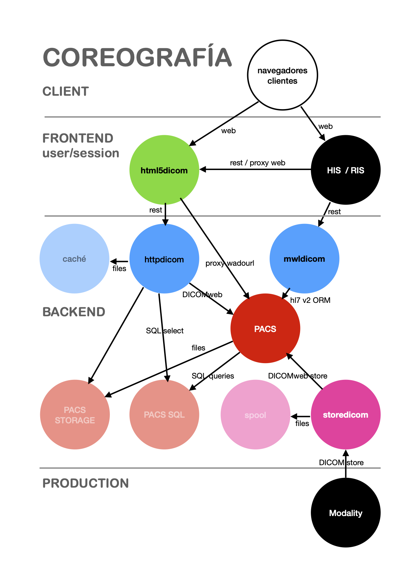

# opendicomdoc
(documentación de los productos Opendicom)

Opendicom brinda soluciones para facilitar el acceso a la imagenología médica fuera de la clínica via HTTP. Diseñamos servicios propios fáciles de integrar con la informática preexistente de las clínicas imagenológicas y coherentes con las tecnologías DICOM definidas en: 

- **parte 18**: Webservices (sintaxis HTTP REST aplicada al modelo de objeto DICOM)
- **parte 20**: Imaging Reports using HL7 Clinical Document Architecture (modelo XML de documento clínico CDA adaptado al informe imagenológico)

La arquitectura de software incluye tres niveles superpuestos relacionados por API claramente definido:

1. La base **dicom** es constituída por las infraestructuras DICOM existentes, aplicaciones, sistema de archivos y base de datos de PACS, por ejemplo el PACS dcm4chee-arc o agregadas por nosotros **nasdicom**, **arcdicom**
2. **httpdicom** interactúa con uno o más nodos de la infraestructura DICOM y publica servicios REST para su consumo por aplicaciones de RIS/HIS del hospital y cualquier programa que necesite datos de imagenología médica. Este nivel no incluye gestión de usuarios ni de sesión.
3. **html5dicom** es un ejemplo de estos programas que consumen servicios de httpdicom. Permite la interacción del usuario mediante comunicación html5 (teleradiología-telediagnóstico). Dentro de las funciones provistas, listamos control de acceso, búsqueda de estudios, visualización y descarga de estudios, edición de informes médicos.                                                                                                                                                                                                             

Además proveemos dos módulos para la puesta en funcionamiento de las listas de trabajo (Modality WorkList):

**storedicom** se interpone entre las modalidades de adquisición y un PACS capaz de recibir archivos a traves de http. La función de spoolstow es de validar los objetos DICOM que se reciben, normalizar ciertos atributos, como por ejemplo el nombre de la institución y comprimir la data de las imágenes en jpeg 2000.

**mwldicom** brinda un interfaz rest de uso sencillo para gestionar una lista de trabajo (Modality WorkList).                                                                                                                                                                                                          

## Articulación de los componentes entre sí

Los sistemas propios de la institución están en negro. Nuestras aplicaciones están en color.

Lineas separan el diagrama en 4 dominios (desde abajo):

- red dicom de producción 
- backend (nunca directamente expuesto a Internet directamente por razones de seguridad)
- frontend expuesto a Internet, pero con seguridad por usuario y sesión de trabajo
- clientes (esencialmente navegadores, pero también estaciones de trabajo, por ejemplo OsiriX u Horos)

pacs, httpdicom y html5dicom son de instalación obligatoria. 

storedicom es opcional pero necesario cuando un mismo pacs contiene los objetos DICOM de varias sucursales.

mwldicom es opcional pero necesario cuando se quiere instalar accesos diferenciados para radiólogo / médico / paciente, etc. mwldicom requiere storedicom para normalizar los datos que entran en el pacs.

